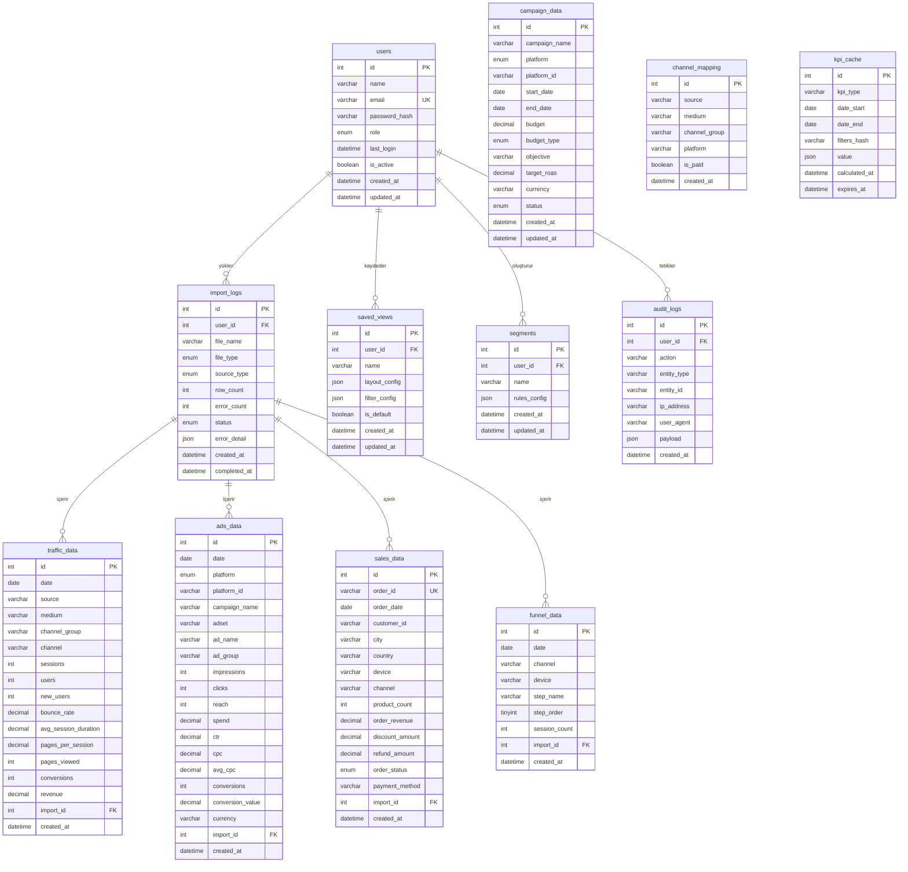

# KPI Dashboard — ER Diyagramı

## Tablo İlişkileri

## Tablo Özeti

| # | Tablo | Satır Sayısı (Tahmini) | Açıklama |
|---|-------|------------------------|----------|
| 1 | `users` | ~10 | Kullanıcılar |
| 2 | `import_logs` | ~100+ | Import geçmişi |
| 3 | `traffic_data` | ~50,000+ | GA trafik verisi |
| 4 | `ads_data` | ~30,000+ | Meta + Google Ads |
| 5 | `sales_data` | ~10,000+ | Sipariş verileri |
| 6 | `campaign_data` | ~50 | Kampanya tanımları |
| 7 | `channel_mapping` | ~20 | Kanal normalizasyonu |
| 8 | `funnel_data` | ~100,000+ | Funnel adımları |
| 9 | `kpi_cache` | ~500 | Hesaplanan KPI'lar |
| 10 | `saved_views` | ~50 | Kaydedilmiş layoutlar |
| 11 | `segments` | ~20 | Kullanıcı segmentleri |
| 12 | `audit_logs` | ~10,000+ | Audit logları |

## Index Stratejisi

| Tablo | Indexli Kolonlar | Gerekçe |
|-------|-----------------|---------|
| `traffic_data` | date, channel, (source,medium), (date,channel) | Filtreli KPI sorguları |
| `ads_data` | date, platform, campaign_name, (date,platform) | ROAS ve kampanya sorguları |
| `sales_data` | order_date, customer_id, channel, city, country, order_status | Cohort ve coğrafi filtreler |
| `funnel_data` | date, step_order, (date,channel) | Funnel analiz sorguları |
| `kpi_cache` | (kpi_type,date_start,date_end,filters_hash) UNIQUE, expires_at | Cache lookup performansı |
| `audit_logs` | user_id, action, created_at | Log filtreleme |
